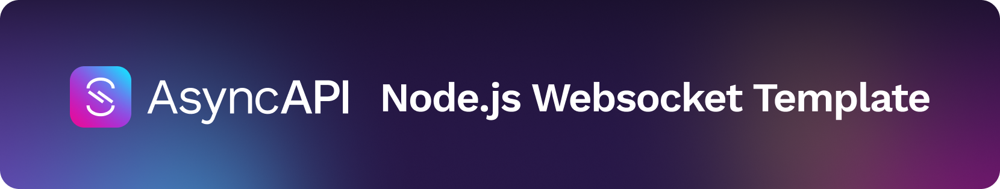

[](https://www.asyncapi.com)

 

<!-- toc is generated with GitHub Actions do not remove toc markers -->

<!-- toc -->

- [Overview](#overview)
- [Technical requirements](#technical-requirements)
- [Specification requirements](#specification-requirements)
- [Supported protocols](#supported-protocols)
- [How to use the template](#how-to-use-the-template)
  * [Interactive Server Client](#interactive-server-client)
  * [Data Streaming Client](#data-streaming-client)
- [Template configuration](#template-configuration)
- [Custom hooks that you can disable](#custom-hooks-that-you-can-disable)
- [Development](#development)
- [Contributors](#contributors)

<!-- tocstop -->

## Overview

This template generates the following resources related to WebSockets:
- Server application with WebSocket endpoint based on [Express.js](https://expressjs.com/)
- Client HTML file with simple scripts that give you a basic API to talk to the server
- Client node-js script to connect and receive data from a websocket data streaming service

Other files are for the setup of developer environment, like `.editorconfig` or `.eslint`.

## Technical requirements

- 0.50.0 =< [Generator](https://github.com/asyncapi/generator/) < 2.0.0,
- Generator specific [requirements](https://github.com/asyncapi/generator/#requirements)


## Specification requirements

This is a very early version of the template and not all specification features are supported:

Property name | Reason | Fallback | Default
---|---|---|---
`servers.*.url` | Template doesn't support variables in the server url. | - | -
`bindings` | Template doesn't use [websockets](https://github.com/asyncapi/bindings/tree/master/websockets) bindings.| - | -
`operationId` | Operation ID must be set for every operation to generate proper functions as there is no fallback in place | - | -

## Supported protocols

[WebSocket](https://en.wikipedia.org/wiki/WebSocket)

## How to use the template

This template must be used with the AsyncAPI Generator. You can find all available options [here](https://github.com/asyncapi/generator/).

### Interactive Server Client

```bash
# Install the AsyncAPI Generator
npm install -g @asyncapi/generator

# Run generation
ag https://raw.githubusercontent.com/asyncapi/generator/v1.4.0/test/docs/ws.yml @asyncapi/nodejs-ws-template -o output -p server=localhost

##
## Start the server 
##

# Go to the generated server
cd output

# Build generated application
npm i

# Start server
npm start

##
## Start the client 
##

# From another terminal tab open generated HTML in browser
open output/index.html

# Open developers console and follow instructions from there
# Connect with server
listen('/echo')

# Send example message
send({ greet: 'Hello from client' })

# You should see the sent message in the logs of the previously started server
```

### Data Streaming Client

In case of one-way data streaming use case, A client program establishes the websocket connection with the specified service and starts to receive data in a streaming fashion. In this usage, a single channel is assumed in the service configuration and only subscribe operation is supported for the channel. To generate the data streaming client, modify the test/streaming.yaml accordingly:
  * specify the service host url
  * specify the channel and bindings associated with the channel
  * specify the message subscribed


```bash
# Install the AsyncAPI Generator
npm install -g @asyncapi/generator

# Run generation
ag test/streaming.yaml @asyncapi/nodejs-ws-template -o output -p server=localhost

##
## Start the client
##

# Go to the generated server
cd output
node client.js
```

## Template configuration

You can configure this template by passing different parameters in the Generator CLI: `-p PARAM1_NAME=PARAM1_VALUE -p PARAM2_NAME=PARAM2_VALUE`

| Name | Description | Required | Default | Allowed Values | Example
|---|---|---|---|---|---|
|server|The server you want to use in the code.|Yes| - | Name of the server from the list of servers under Servers object | `localhost`|


## Custom hooks that you can disable

The functionality of this template is extended with different hooks that you can disable like this in the Generator CLI: `-d HOOK_TYPE1=HOOK_NAME1,HOOK_NAME2 -d HOOK_TYPE2`

Type | Name | Description
---|---|---
generate:after | createAsyncapiFile | It creates AsyncAPI file with content of the spec file passed to the generator

## Development

The most straightforward command to use this template is:
```bash
ag https://raw.githubusercontent.com/asyncapi/generator/v1.4.0/test/docs/ws.yml @asyncapi/nodejs-ws-template -o output -p server=localhost
```

For local development, you need different variations of this command. First of all, you need to know about three important CLI flags:
- `--debug` enables the debug mode in Nunjucks engine what makes filters debugging simpler. 
- `--watch-template` enables a watcher of changes that you make in the template. It regenerates your template whenever it detects a change.
- `--install` enforces reinstallation of the template.


There are two ways you can work on template development:
- Use global Generator and template from your local sources:
  ```bash
  # assumption is that you run this command from the root of your template
  ag https://raw.githubusercontent.com/asyncapi/generator/v1.4.0/test/docs/ws.yml ./ -o output
  ```
- Use Generator from sources and template also from local sources. This approach enables more debugging options with awesome `console.log` in the Generator sources or even the Parser located in `node_modules` of the Generator:
  ```bash
  # assumption is that you run this command from the root of your template
  # assumption is that generator sources are cloned on the same level as the template
  ../generator/cli.js https://raw.githubusercontent.com/asyncapi/generator/v1.4.0/test/docs/ws.yml ./ -o output
  ```


## Contributors

Thanks goes to these wonderful people ([emoji key](https://allcontributors.org/docs/en/emoji-key)):

<!-- ALL-CONTRIBUTORS-LIST:START - Do not remove or modify this section -->
<!-- prettier-ignore-start -->
<!-- markdownlint-disable -->
<table>
  <tr>
    <td align="center"><a href="http://www.fmvilas.com/"><br /><sub><b>Fran Méndez</b></sub></a><br /><a href="https://github.com/asyncapi/nodejs-ws-template/commits?author=fmvilas" title="Code">💻</a> <a href="#ideas-fmvilas" title="Ideas, Planning, & Feedback">🤔</a></td>
    <td align="center"><a href="https://dev.to/derberg"><br /><sub><b>Lukasz Gornicki</b></sub></a><br /><a href="#infra-derberg" title="Infrastructure (Hosting, Build-Tools, etc)">🚇</a> <a href="https://github.com/asyncapi/nodejs-ws-template/commits?author=derberg" title="Code">💻</a> <a href="https://github.com/asyncapi/nodejs-ws-template/pulls?q=is%3Apr+reviewed-by%3Aderberg" title="Reviewed Pull Requests">👀</a> <a href="#maintenance-derberg" title="Maintenance">🚧</a> <a href="https://github.com/asyncapi/nodejs-ws-template/commits?author=derberg" title="Documentation">📖</a> <a href="#blog-derberg" title="Blogposts">📝</a></td>
    <td align="center"><a href="https://aayushsahu.com"><br /><sub><b>Aayush Kumar Sahu</b></sub></a><br /><a href="#security-aayushmau5" title="Security">🛡️</a></td>
    <td align="center"><a href="https://github.com/KatrinaAS"><br /><sub><b>Katrina Knight</b></sub></a><br /><a href="#infra-KatrinaAS" title="Infrastructure (Hosting, Build-Tools, etc)">🚇</a></td>
    <td align="center"><a href="https://github.com/RageZBla"><br /><sub><b>Olivier Lechevalier</b></sub></a><br /><a href="https://github.com/asyncapi/nodejs-ws-template/commits?author=RageZBla" title="Code">💻</a></td>
    <td align="center"><a href="https://github.com/Krishks369"><br /><sub><b>Krishna Kumar S</b></sub></a><br /><a href="https://github.com/asyncapi/nodejs-ws-template/commits?author=Krishks369" title="Tests">⚠️</a></td>
  </tr>
</table>

<!-- markdownlint-restore -->
<!-- prettier-ignore-end -->

<!-- ALL-CONTRIBUTORS-LIST:END -->

This project follows the [all-contributors](https://github.com/all-contributors/all-contributors) specification. Contributions of any kind welcome!